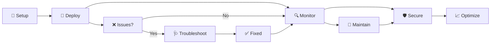

# 🏃‍♂️ ARC Config Repository

[](https://github.com/features/actions)
[](https://kubernetes.io/)
[](https://github.com/actions/actions-runner-controller)
[](https://github.com/tsviz/k8s-mcp)

> **🎯 Enterprise-ready configuration repository for GitHub Actions Runner Controller (ARC) scale sets and policies.**

This repository demonstrates production-grade ARC deployments with comprehensive examples, automated validation, security best practices, and **AI-powered operational workflows** using the k8s-mcp server integration.

## 📁 Repository Structure

```
arc-config-repo/
├── 🏃 runners/                    # Runner scale set configurations
│   ├── org-level/                 # Organization-wide runners
│   └── repo-level/                # Repository-specific runners
├── 🛡️ policies/                   # Governance and security policies
│   ├── org-level-policy.yaml      # Organization policies
│   └── repo-level/                # Repository-specific overrides
├── 📋 templates/                  # Reusable configuration templates
│   ├── runner-set-template.yaml   # Generic runner template
│   └── policy-template.yaml       # Generic policy template
├── 🔧 scripts/                    # Automation and validation
│   ├── validate-config.sh         # Configuration validation
│   └── apply-config.sh            # Deployment automation
├── 📚 docs/                       # Comprehensive documentation
│   ├── QUICKSTART.md              # Quick start guide
│   ├── FAQ.md                     # Troubleshooting & FAQ
│   ├── ARC_Troubleshooting_with_MCP.md  # AI-powered troubleshooting
│   └── ARC_Runner_Maintenance_with_MCP.md  # Operational maintenance
└── ⚙️ .github/workflows/          # CI/CD automation
    └── validate-config.yml        # Automated validation
```

## 🚀 Quick Start

Get up and running in minutes:

```bash
# 1. Validate all configurations
./scripts/validate-config.sh -v

# 2. Deploy configurations to your cluster
./scripts/apply-config.sh

# 3. Create custom runners from templates
cp templates/runner-set-template.yaml runners/repo-level/my-team/my-new-runners.yaml
```

> 💡 **Pro Tip**: Start with the [troubleshooting guide](./docs/ARC_Troubleshooting_with_MCP.md) if you're setting up ARC for the first time!

## ✨ Key Features

<table>
<tr>
<td>🤖</td>
<td><strong>AI-Powered Operations</strong><br/>IDE-integrated troubleshooting and maintenance with GitHub Copilot + k8s-mcp</td>
</tr>
<tr>
<td>🔒</td>
<td><strong>Security First</strong><br/>Built-in security best practices, policy enforcement, and compliance automation</td>
</tr>
<tr>
<td>📏</td>
<td><strong>Enterprise Scale</strong><br/>Multi-tenancy patterns supporting organization and repository-level configurations</td>
</tr>
<tr>
<td>🔄</td>
<td><strong>GitOps Ready</strong><br/>Automated validation, CI/CD integration, and template-based consistency</td>
</tr>
<tr>
<td>📚</td>
<td><strong>Production Guide</strong><br/>Comprehensive documentation from setup to ongoing operational excellence</td>
</tr>
</table>

## 🧠 MCP-Powered ARC Operations

Transform your ARC operations with **AI-assisted Kubernetes management** directly in your IDE. No more context switching between terminals, browsers, and documentation!

<div align="center">

### 🔄 **The Complete ARC Journey**



</div>

---

### 🩺 **Phase 1: Troubleshooting & Setup**
**[📖 `docs/ARC_Troubleshooting_with_MCP.md`](./docs/ARC_Troubleshooting_with_MCP.md)**

<table>
<tr>
<td width="20%"><strong>🎯 Purpose</strong></td>
<td>Get ARC runners operational when things go wrong</td>
</tr>
<tr>
<td><strong>📊 Coverage</strong></td>
<td>Two detailed case studies: reactive debugging → proactive governance</td>
</tr>
<tr>
<td><strong>⚡ Key Benefits</strong></td>
<td>
• 75% faster MTTR<br/>
• Zero context switching<br/>
• Policy-aware troubleshooting<br/>
• AI-guided problem resolution
</td>
</tr>
<tr>
<td><strong>🔧 Use When</strong></td>
<td>First-time setup • Runner issues • Authentication problems • Version conflicts</td>
</tr>
</table>

---

### �️ **Phase 2: Operations & Maintenance**
**[📖 `docs/ARC_Runner_Maintenance_with_MCP.md`](./docs/ARC_Runner_Maintenance_with_MCP.md)**

<table>
<tr>
<td width="20%"><strong>🎯 Purpose</strong></td>
<td>Transform from "working" to "production-ready" and "continuously compliant"</td>
</tr>
<tr>
<td><strong>📊 Coverage</strong></td>
<td>Security hardening • Scaling optimization • Policy compliance • Automated workflows</td>
</tr>
<tr>
<td><strong>⚡ Key Benefits</strong></td>
<td>
• Structured remediation planning<br/>
• Compliance automation (≥90% target)<br/>
• Cost optimization strategies<br/>
• Executive-ready reporting
</td>
</tr>
<tr>
<td><strong>🔧 Use When</strong></td>
<td>Post-deployment hardening • Regular maintenance • Compliance audits • Performance tuning</td>
</tr>
</table>

---

### 🎯 **Recommended Workflow**

```bash
# Step 1: Establish functional deployment
📖 Follow ARC_Troubleshooting_with_MCP.md

# Step 2: Achieve operational excellence  
📖 Apply ARC_Runner_Maintenance_with_MCP.md

# Step 3: Maintain consistency
🔄 Use MCP configuration profiles for safe operations
```

> **🚀 Why This Matters**: Traditional Kubernetes operations involve juggling multiple terminals, context switching between tools, and manual authentication setup. Our **GitHub Copilot + k8s-mcp server** integration eliminates this complexity by bringing everything into your IDE with intelligent AI guidance.

<div align="center">

**🏆 Result: From hours to minutes • From reactive to proactive • From complex to conversational**

</div>

## 💼 What This Repository Demonstrates

<div align="center">

| 🏢 **Enterprise Patterns** | 🔒 **Security & Governance** | ⚙️ **Operations** |
|:-------------------------:|:---------------------------:|:-----------------:|
| Multi-tenancy (org/repo) | Security configurations | Resource management |
| Template-based consistency | Policy-based governance | Scaling strategies |
| GitOps workflows | Compliance automation | Performance monitoring |
| CI/CD integration | Access controls | Cost optimization |

</div>

---

## 🎯 Getting Started

Choose your path based on your current situation:

<table>
<tr>
<th>🆕 New to ARC</th>
<th>🔧 ARC Running</th>
<th>🏢 Production Ready</th>
</tr>
<tr>
<td>
1. Start with <a href="./docs/QUICKSTART.md">QUICKSTART.md</a><br/>
2. If issues arise, use <a href="./docs/ARC_Troubleshooting_with_MCP.md">Troubleshooting Guide</a><br/>
3. Explore templates in <code>templates/</code>
</td>
<td>
1. Run <code>./scripts/validate-config.sh</code><br/>
2. Review <a href="./docs/ARC_Runner_Maintenance_with_MCP.md">Maintenance Guide</a><br/>
3. Implement security hardening
</td>
<td>
1. Audit with MCP compliance tools<br/>
2. Set up monitoring & alerting<br/>
3. Establish maintenance schedules
</td>
</tr>
</table>

---

## 📚 Additional Resources

- 🔗 **[k8s-mcp Server](https://github.com/tsviz/k8s-mcp)** - The MCP integration that powers our AI workflows
- 📖 **[GitHub ARC Documentation](https://github.com/actions/actions-runner-controller)** - Official ARC controller docs
- 🌐 **[Model Context Protocol](https://modelcontextprotocol.io/)** - Learn about the MCP standard

---

<div align="center">

**⭐ Found this useful? Star the repo and share your ARC success stories!**

---

*📅 Documentation updated: Sun Sep 28 18:07:53 UTC 2025*

</div>
