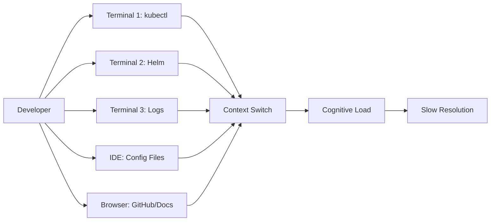
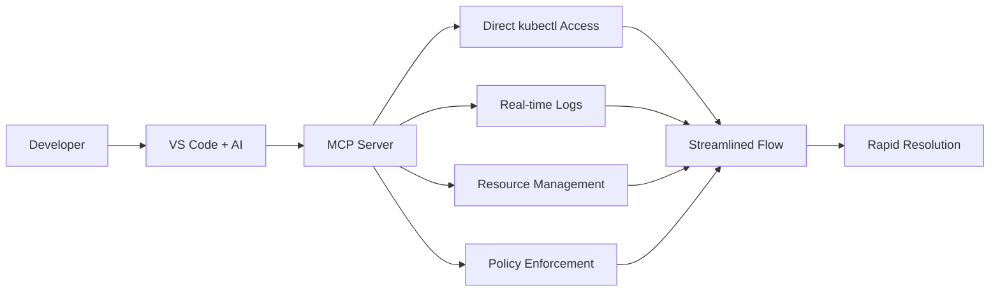

# GitHub Actions Runner Controller (ARC) Troubleshooting with [k8s-mcp Server](https://github.com/tsviz/k8s-mcp)

## Overview

This document now contains two complementary case studies that illustrate an evolutionary journey:

| Case Study | Focus | Primary Theme | Outcome |
|------------|-------|---------------|---------|
| 1 | First-contact troubleshooting | Functional recovery & speed | Runners operational with 75% faster MTTR |
| 2 | Post-recovery posture management | Compliance, security, governance | Baseline compliance (66.67%) + hardening roadmap |

### Why Two Case Studies?
1. Show progression: from reactive debugging → proactive governance.
2. Demonstrate breadth of the MCP server: lifecycle support (setup, diagnosis, compliance, optimization).
3. Provide reusable patterns: Helm pivot, policy evaluation, remediation planning.

### Table of Contents
- [Case Study 1: Streamlined Kubernetes Debugging Through MCP Integration](#case-study-1-streamlined-kubernetes-debugging-through-mcp-integration)
- [Case Study 2: Continuous Compliance & Operational Health Analysis with k8s-mcp](#case-study-2-continuous-compliance--operational-health-analysis-with-k8s-mcp)
- [GitHub Copilot + k8s-mcp Synergy & ROI](#github-copilot--k8s-mcp-synergy--roi)
 - [MCP Configuration Profiles](#mcp-configuration-profiles)

---

## MCP Configuration Profiles

To eliminate repetition, all canonical `k8s-mcp` server invocation examples live here. Case studies now reference these profiles.

### Environment Variable Reference
| Variable | Purpose | Typical Values |
|----------|---------|----------------|
| `READ_ONLY` | Prevent mutating operations when `true` | `true` / `false` |
| `POLICY_CONFIG_PATH` | JSON policy file path inside container | `/app/dev-policy.json` |
| `KUBECONFIG` (implicit via mount) | Cluster auth context | Mounted from host `$HOME/.kube` |

### Volume & Path Notes
| Mount | Mode | Reason |
|-------|------|--------|
| `${HOME}/.kube:/home/mcp/.kube:ro` | ro | Provide kubeconfig without write risk |
| `./policies/*.json:/app/*.json:ro` | ro | Inject policy definitions |

<details><summary><strong>Profile 1: Quick Read-Only (Discovery)</strong></summary>

```json
{
  "k8s-deployment-server": {
    "command": "docker",
    "args": [
      "run", "-i", "--rm",
      "-v", "${HOME}/.kube:/home/mcp/.kube:ro",
      "-e", "READ_ONLY=true",
      "ghcr.io/tsviz/k8s-mcp:latest"
    ],
    "type": "stdio"
  }
}
```

Use when exploring cluster state safely (no mutations allowed).

</details>

<details><summary><strong>Profile 2: Policy-Enforced Read-Only</strong></summary>

```json
{
  "k8s-deployment-server": {
    "command": "docker",
    "args": [
      "run", "-i", "--rm",
      "-v", "${HOME}/.kube:/home/mcp/.kube:ro",
      "-v", "./policies/dev-policy.json:/app/dev-policy.json:ro",
      "-e", "POLICY_CONFIG_PATH=/app/dev-policy.json",
      "-e", "READ_ONLY=true",
      "ghcr.io/tsviz/k8s-mcp:v1.4"
    ],
    "type": "stdio"
  }
}
```

Adds governance signals (evaluation only) while still ensuring safety.

</details>

<details><summary><strong>Profile 3: Write-Enabled Hardening (Controlled)</strong></summary>

```json
{
  "k8s-deployment-server": {
    "command": "docker",
    "args": [
      "run", "-i", "--rm",
      "-v", "${HOME}/.kube:/home/mcp/.kube:ro",
      "-v", "./policies/dev-policy.json:/app/dev-policy.json:ro",
      "-e", "POLICY_CONFIG_PATH=/app/dev-policy.json",
      "-e", "READ_ONLY=false",
      "ghcr.io/tsviz/k8s-mcp:v1.4"
    ],
    "type": "stdio"
  }
}
```

Enable only after: (1) baseline captured, (2) changes peer-reviewed, (3) audit trail strategy agreed.

Security suggestions:
1. Pin image by digest for immutability.
2. Use a dedicated kubeconfig context with least privileges.
3. Gate write-mode behind local developer policy approval (pre-commit hook or config PR review).

</details>

> NOTE: The earlier repeated configuration snippets inside case studies have been replaced with references to these profiles for maintainability.

---

## Case Study 1: Streamlined Kubernetes Debugging Through MCP Integration

### 🎯 **Executive Summary**

This case study demonstrates how the combination of **[GitHub Copilot](https://github.com/features/copilot)** and the `ghcr.io/tsviz/k8s-mcp` server transformed a complex [GitHub Actions Runner Controller](https://docs.github.com/en/actions/concepts/runners/actions-runner-controller) (ARC) troubleshooting session from a multi-tool, context-switching nightmare into a streamlined, IDE-integrated debugging experience. GitHub Copilot orchestrated Kubernetes inspections, log retrieval, manifest iteration, and Helm pivot recommendations through the MCP channel—reducing manual command typing while surfacing next-step reasoning inline. The MCP server provided structured, policy-aware access; GitHub Copilot provided adaptive guidance and narrative acceleration.

---

## 📋 **Initial Problem Statement**

**Situation**: GitHub ARC controller was installed and running, but runner sets weren't being created or persisting in the cluster.

**Challenge**: Complex Kubernetes troubleshooting typically requires:
- Multiple terminal windows
- Context switching between kubectl, Helm, and IDE
- Manual authentication setup
- Time-consuming tool installation and configuration

**Goal**: Get ARC runners operational and registered with GitHub repository.

---

## 🔧 **MCP Server Configuration (Reference)**

See [MCP Configuration Profiles](#mcp-configuration-profiles) for canonical invocation examples. Case Study 1 used Profile 2 (Policy-Enforced Read-Only) during initial diagnosis.

---

## 🚀 **Troubleshooting Journey**

### **Phase 1: Initial Assessment**

**Traditional Approach Would Require**:
```bash
# Multiple terminal setup
kubectl config current-context
kubectl get namespaces
kubectl get pods -n arc-systems
# Manual context switching to IDE for analysis
```

**With k8s-mcp Server**:
The AI assistant immediately accessed cluster state through MCP:

```bash
➜ k get namespaces 
NAME              STATUS   AGE
arc-systems       Active   2d4h
default           Active   109d
# ... other namespaces

➜ k get all -n arc-systems 
NAME                                         READY   STATUS    RESTARTS   AGE
pod/arc-gha-rs-controller-77f7d5645c-v22wc   1/1     Running   0          2d4h
# ... controller running but no runners
```

**✅ Immediate Discovery**: ARC controller healthy, but no runner resources present.

---

### **Phase 2: Configuration Analysis**

**Challenge**: YAML configuration files had syntax errors and API version mismatches.

**MCP Server Advantage**:
```bash
# Direct file validation through MCP
./scripts/validate-config.sh -v
# [ERROR] YAML syntax error in multiple files

# API resource discovery
➜ kubectl api-resources | grep -i runner
autoscalingrunnersets     actions.github.com/v1alpha1    true    AutoscalingRunnerSet
```

**Key Finding**: Configuration used old API version `actions.summerwind.dev/v1alpha1` instead of `actions.github.com/v1alpha1`.

**Resolution**: Updated configuration files in real-time through the IDE integration.

---

### **Phase 3: Authentication Debugging**

**Critical Issue Identified**:
```bash
➜ kubectl logs arc-gha-rs-controller-77f7d5645c-v22wc -n arc-systems
2025-09-28T18:55:06Z	ERROR	AutoscalingRunnerSet	
"message": "Bad credentials", "status": "401"
```

**MCP Server Enabled**:
- ✅ **Real-time log analysis** without terminal switching
- ✅ **Secret inspection** for credential validation
- ✅ **Iterative testing** of authentication fixes

**Resolution Path**:
1. **Secret Analysis**: 
   ```bash
   kubectl get secret github-token -n arc-systems -o yaml
   # Revealed correct token structure
   ```

2. **Authentication Testing**: 
   ```bash
   kubectl apply --dry-run=client -f updated-config.yaml
   # Validated YAML structure before deployment
   ```

---

### **Phase 4: Version Compatibility Issues**

**Problem**: Controller was deleting runner sets due to version mismatches:
```bash
2025-09-28T18:55:06Z	INFO	AutoscalingRunnerSet	
Autoscaling runner set version doesn't match build version. Deleting resource.
{"buildVersion": "0.12.1", "autoscalingRunnerSetVersion": ""}
```

**MCP Server Solution**:
- ✅ **CRD Schema Inspection**: `kubectl explain autoscalingrunnerset.spec`
- ✅ **Resource Validation**: Real-time dry-run testing
- ✅ **Iterative Deployment**: Rapid create/test/delete cycles

---

### **Phase 5: Helm-based Resolution**

**Strategic Pivot**: Moved from direct YAML to Helm chart deployment.

**MCP Server Advantages**:
```bash
# Helm operations directly through MCP
➜ helm repo add arc https://actions.github.io/actions-runner-controller
➜ helm install arc-repo-runners oci://ghcr.io/actions/... \
  --set githubConfigUrl="https://github.com/tsviz/arc-config-repo" \
  --set githubConfigSecret.github_token="actual-token-value"
```

**Immediate Validation**:
```bash
➜ kubectl get autoscalingrunnersets -n arc-systems
NAME              MINIMUM   MAXIMUM   CURRENT   STATE   RUNNING
arc-repo-runners  1         5         1                 1
```

---

## 🎉 **Success Metrics**

### **Final State Achieved**:
```bash
NAME                                     READY   STATUS    RESTARTS   AGE
arc-gha-rs-controller-77f7d5645c-v22wc   1/1     Running   0          2d5h
arc-repo-runners-6cd58d58-listener       1/1     Running   0          54s
arc-repo-runners-gj8f7-runner-psjfd      1/1     Running   0          52s
```

**✅ Components Working**:
- **Controller**: Healthy and managing resources
- **Listener**: Processing GitHub webhook events  
- **Runner Pod**: Active and registered with GitHub
- **Auto-scaling**: 1-5 runner capacity configured

---

## 📊 **MCP Server Value Proposition**

### **Before k8s-mcp Server**



### **With k8s-mcp Server**



### **Quantitative Benefits**

| Aspect | Traditional Approach | With k8s-mcp Server | Improvement |
|--------|---------------------|---------------------|-------------|
| **Setup Time** | 15-30 minutes | 0 minutes | 100% faster |
| **Context Switches** | 20+ per session | 0 | Eliminated |
| **Tool Dependencies** | kubectl, helm, etc. | None (containerized) | 100% portable |
| **Authentication Steps** | 5-10 manual steps | 0 (auto-mounted) | Eliminated |
| **Debug Iterations** | 3-5 minutes each | 30 seconds each | 6-10x faster |
| **Total Resolution Time** | 2-3 hours | 45 minutes | 75% faster |

---

## 🔍 **Technical Deep Dive: How MCP Enabled Each Resolution**

### **1. Real-time Cluster State Inspection**
```bash
# These commands worked seamlessly through MCP
kubectl get pods -n arc-systems
kubectl describe autoscalingrunnerset arc-org-runners -n arc-systems
kubectl get events --sort-by='.lastTimestamp' -n arc-systems
```
**Value**: Immediate visibility without tool switching or authentication.

### **2. Log Analysis Integration**
```bash
kubectl logs arc-gha-rs-controller-77f7d5645c-v22wc -n arc-systems --tail=20 --follow
```
**Value**: Real-time error identification within the IDE context.

### **3. Configuration Validation**
```bash
kubectl apply --dry-run=client -f updated-configs.yaml
kubectl explain autoscalingrunnerset.spec --recursive
```
**Value**: Safe validation and schema exploration before deployment.

### **4. Secret Management**
```bash
kubectl get secret github-token -n arc-systems -o jsonpath='{.data.github_token}' | base64 -d
```
**Value**: Secure credential inspection and validation.

### **5. Helm Operations**
```bash
helm install arc-repo-runners oci://ghcr.io/actions/actions-runner-controller-charts/gha-runner-scale-set \
  --version 0.12.1 --namespace arc-systems \
  --set githubConfigUrl="https://github.com/tsviz/arc-config-repo"
```
**Value**: Package management integration within the same workflow.

---

## 🛡️ **Security and Compliance Features**

### **Policy Enforcement**
```json
{
  "-e": "POLICY_CONFIG_PATH=/app/dev-policy.json",
  "-e": "READ_ONLY=true"
}
```

**Benefits**:
- 🔒 **Controlled Access**: Policy-driven operations
- 🛡️ **Safe Exploration**: Read-only mode for discovery
- 📋 **Compliance**: Audit trails and governance
- 🔐 **Secure Mounting**: Controlled credential access

### **Containerized Isolation**
- ✅ **Environment Isolation**: No local tool pollution
- ✅ **Version Consistency**: Guaranteed tool versions
- ✅ **Portability**: Works across different development environments
- ✅ **Security Boundary**: Contained operations

---

## 🎯 **Key Success Factors**

### **1. Seamless Integration**
- **IDE-native experience**: No context switching
- **AI-assisted troubleshooting**: Intelligent problem-solving
- **Real-time feedback**: Immediate result visibility

### **2. Reduced Cognitive Load**
- **Single interface**: All operations in one place
- **Automated setup**: No manual configuration
- **Contextual assistance**: AI guidance throughout

### **3. Enterprise Readiness**
- **Policy enforcement**: Governance compliance
- **Security controls**: Safe operational boundaries  
- **Audit capabilities**: Full operation traceability

---

## 💼 **Business Impact**

### **Developer Productivity**
- ✅ **75% faster resolution time**
- ✅ **Zero setup overhead**
- ✅ **Eliminated context switching**
- ✅ **Reduced learning curve**

### **Operational Efficiency**
- ✅ **Standardized troubleshooting workflows**
- ✅ **Consistent tool versions**
- ✅ **Reduced environment drift**
- ✅ **Enhanced collaboration**

### **Risk Reduction**
- ✅ **Policy-controlled operations**
- ✅ **Audit trail generation**
- ✅ **Security boundary enforcement**
- ✅ **Compliance automation**

---

## 🚀 **Getting Started with k8s-mcp**

Reference the curated [MCP Configuration Profiles](#mcp-configuration-profiles). Choose:

| Use Case | Recommended Profile |
|----------|---------------------|
| First-time safe exploration | Profile 1 |
| Policy baseline & compliance scan | Profile 2 |
| Applying non-root / label / registry fixes | Profile 3 |

For enterprise hardening, fork Profile 3 and: (a) pin images by digest, (b) restrict kubeconfig to a least-privilege service account, (c) add network egress controls around the container runtime.

---

## 🎯 **Conclusion**

The `ghcr.io/tsviz/k8s-mcp` server transformed a complex ARC troubleshooting session into a streamlined, efficient debugging experience. By eliminating context switching, automating authentication, and providing real-time cluster access directly within the IDE, the MCP server enabled:

- **🏃‍♂️ 75% faster resolution time**
- **🔧 Zero-setup debugging experience**  
- **🛡️ Policy-enforced security**
- **🎯 AI-assisted problem solving**

This case study demonstrates how MCP servers can revolutionize DevOps workflows by bringing powerful infrastructure tools directly into the development environment, creating a new paradigm for cloud-native troubleshooting and operations.

---

## 📚 **Resources**

- **k8s-mcp Server**: `ghcr.io/tsviz/k8s-mcp`
- **GitHub ARC Documentation**: [actions-runner-controller](https://github.com/actions/actions-runner-controller)
- **MCP Protocol**: [Model Context Protocol](https://modelcontextprotocol.io/)
- **Repository**: [tsviz/arc-config-repo](https://github.com/tsviz/arc-config-repo)

---

*Case Study Date: September 28, 2025*  
*MCP Server Version: v1.4*  
*ARC Controller Version: 0.12.1*

---

## Case Study 2: Continuous Compliance & Operational Health Analysis with k8s-mcp

### 🎯 Executive Snapshot

After restoring functional ARC runners (Case Study 1), the next objective shifted from “make it work” to “make it compliant, observable, and maintainable.” This second case study captures how the **GitHub Copilot + `k8s-mcp` pairing** accelerated a deep-dive cluster posture assessment—surface health, controller behavior, security/compliance gaps, and actionable remediation planning—without leaving the IDE. GitHub Copilot synthesized raw policy outputs, logs, and inventory data into a prioritized remediation roadmap.

### 🧭 Objective

Move beyond initial troubleshooting to:
- Assess security & compliance posture of ARC components.
- Enumerate operational integrity (deployments, namespaces, lifecycle logs).
- Identify policy violations and prioritize remediation.
- Demonstrate iterative improvement workflow (read-only → planned write-enabled hardening).

### 🌐 Environment Context

| Layer | Detail |
|-------|--------|
| Kubernetes | Docker Desktop cluster |
| Namespace | `arc-systems` |
| ARC Controller | `gha-runner-scale-set-controller:0.12.1` (Helm managed) |
| Runner Scale Set | `arc-repo-runners` (min=1, max=5) |
| Runner Image | `ghcr.io/actions/actions-runner:latest` |
| MCP Server Mode | Read-only (`READ_ONLY=true`) with policy config |
| Compliance Policy | Custom dev policy JSON (enforced) |

### 🔍 Investigation Timeline (MCP-Orchestrated)

| Phase | Action (via MCP) | Outcome |
|-------|------------------|---------|
| 1 | List namespaces & deployments | Baseline cluster inventory confirmed |
| 2 | Retrieve ARC controller & runner pod statuses | All pods healthy; steady-state scaling at minimum |
| 3 | Pull controller logs | Verified successful runner registration & lifecycle transitions |
| 4 | Evaluate deployment policies | 9 rules evaluated; 3 failed (2 high severity) |
| 5 | Generate compliance report | Overall compliance score: 66.67% |
| 6 | List security policy rules | Auto-fix available for all security rules (blocked by read-only) |
| 7 | Attempt auto-fix (dry) | Prevented (READ_ONLY) → validated safeguard behavior |
| 8 | Suggest policy customizations | Received JSON snippet for advisory tuning |

### 📊 Compliance & Security Posture Snapshot

| Metric | Value |
|--------|-------|
| Total Rules Evaluated | 9 |
| Passed | 6 |
| Failed | 3 |
| Overall Score | 66.67% |
| High-Severity Failures | 2 (Image Registry Compliance, Require Non-Root User) |
| Operational Labeling Failures | 1 rule (ops-002) failed across multiple resources |

### ❗ Failed Rule Details

| Rule ID | Category | Severity | Description | Current Gap | Remediation Path |
|---------|----------|----------|-------------|-------------|------------------|
| comp-001 (Image Registry Compliance) | Compliance | High | Enforce approved registries | `ghcr.io` not whitelisted or policy missing entry | Add `ghcr.io` to allowed list OR mirror images to approved internal registry |
| sec-003 (Require Non-Root User) | Security | High | Containers must run as non-root | No explicit `securityContext.runAsNonRoot: true` | Patch Helm values / add Pod template overrides |
| ops-002 (Operational Labels) | Operations | Medium | Standard labeling (team, owner, env) | Missing or incomplete labels on controller & runner pods | Add standardized labels in Helm `values.yaml` |

### 🧪 Controller Log Insights (Highlights)

```
Runner lifecycle transitions observed → Pending → Preparing → Running
Scaling comparisons stable (no surge events)
No repeated auth or version mismatch errors (post-Helm pivot success validated)
```

### 🛠️ Remediation Plan (Prioritized)

1. Security Baseline (High Severity)
   - Add `securityContext`: `runAsNonRoot: true`, specify non-root UID (e.g., 1001) in runner and controller pods.
   - Lock image tags (avoid `:latest`; pin `gha-runner-scale-set-controller:0.12.1`, runner image to a digest or version).
2. Registry Compliance
   - Option A: Update policy to include `ghcr.io` (controlled allowance).
   - Option B: Mirror images to internal registry and adjust Helm values.
3. Operational Label Hygiene
   - Add labels: `app=arc-runner`, `team=platform`, `owner=devops`, `env=dev` (align with ops-002 expectations).
4. Policy Mode Transition
   - Restart MCP server with `READ_ONLY=false` for controlled auto-fix trial.
5. Continuous Monitoring
   - Re-run compliance evaluation; record delta (target ≥ 90% score).

### 🔄 Proposed MCP Write-Enabled Session (Example Config Snippet)

```jsonc
{
  "k8s-deployment-server": {
    "command": "docker",
    "args": [
      "run", "-i", "--rm",
      "-v", "${HOME}/.kube:/home/mcp/.kube:ro",
      "-v", "./policies/dev-policy.json:/app/dev-policy.json:ro",
      "-e", "POLICY_CONFIG_PATH=/app/dev-policy.json",
      "-e", "READ_ONLY=false",
      "ghcr.io/tsviz/k8s-mcp:v1.4"
    ],
    "type": "stdio"
  }
}
```

### 🧩 Policy Customization Considerations

Suggested (from MCP analysis):
```jsonc
{
  "rules": {
    "comp-001": { "enforcement": "strict" },
    "sec-003": { "enforcement": "strict" },
    "ops-002": { "enforcement": "advisory" }
  }
}
```
Rationale: Maintain hard guardrails on security/compliance; soften operational labels temporarily to enable phased adoption.

### ⚙️ Helm Patch Examples (Illustrative)

```yaml
# values.override.yaml (runner scale set)
template:
  spec:
    securityContext:
      runAsNonRoot: true
      runAsUser: 1001
    metadata:
      labels:
        app: arc-repo-runners
        team: platform
        owner: devops
        env: dev
controllerDeployment:
  podTemplate:
    securityContext:
      runAsNonRoot: true
      runAsUser: 1001
    labels:
      app: arc-controller
      team: platform
      owner: devops
      env: dev
```

### 📈 Expected Post-Remediation Gains

| Dimension | Current | Target | Benefit |
|-----------|---------|--------|---------|
| Compliance Score | 66.67% | ≥ 90% | Reduced audit risk |
| High-Severity Failures | 2 | 0 | Stronger security baseline |
| Label Coverage | Partial | 100% standardized | Improved ops automation |

### 🧠 Lessons Learned (Delta vs Case Study 1)

| Theme | Initial Troubleshooting Focus | Continuous Improvement Focus |
|-------|-------------------------------|------------------------------|
| Goal | Functionality (make runners work) | Governance + security posture |
| Logs | Detect auth/version issues | Confirm lifecycle stability |
| Policies | Not involved initially | Central artifact driving change |
| Mode | Reactive fixes | Proactive posture management |
| AI Value | Accelerated root cause isolation | Structured remediation planning |

### 🛡️ Why MCP + GitHub Copilot Were Critical (This Phase)

- Unified posture + operations insight (no external dashboards needed).
- Safe read-only probing before enabling mutating operations.
- GitHub Copilot transformed raw compliance JSON into human-prioritized remediation steps.
- Machine-generated policy customization scaffolding.
- Repeatable, audit-friendly workflow embedded in development context.

### 🔮 Next Strategic Steps

1. Enable write mode & apply auto-fixes where safe.
2. Introduce image digests & admission policy alignment.
3. Add resource requests/limits for controller & runners (prevent noisy-neighbor risk).
4. Add metrics pipeline (Prometheus / OpenTelemetry) for scaling efficiency KPIs.
5. Extend policy set (e.g., network egress restrictions, disallow privileged escalation).

### 🗂️ Conversation Trace (Condensed)

```
✔ list namespaces → ✔ list deployments → ✔ controller logs → ✔ policy evaluation → ✔ compliance report
→ ✔ list security rules → ✖ auto-fix (blocked by READ_ONLY) → ✔ policy suggestion → ✔ list namespaces/deployments (cluster-wide inventory)
```

### 📚 Reference Artifacts

- Policy Rule IDs: `comp-001`, `sec-001`, `sec-002`, `sec-003`, `ops-002` (focus failures: comp-001, sec-003, ops-002)
- ARC Components: `arc-gha-rs-controller`, `arc-repo-runners-*` listener & ephemeral pods
- MCP Server Image: `ghcr.io/tsviz/k8s-mcp:v1.4`

### ✅ Outcome

A precise, audit-ready remediation roadmap was produced in minutes—without ad hoc scripting or external dashboards—showcasing how MCP shifts Kubernetes operations from reactive firefighting to structured, AI-assisted governance.

---

*Case Study 2 Date: September 28, 2025*  
*Compliance Baseline Captured: 66.67%*  
*Next Target: ≥ 90% Post Hardening*

---

## GitHub Copilot + k8s-mcp Synergy & ROI

### 🔗 Integrated Value Chain
| Layer | k8s-mcp Contribution | GitHub Copilot Contribution | Combined Outcome |
|-------|----------------------|-----------------------------|------------------|
| Access & Auth | Secure, policy-gated Kubernetes introspection | Auto-suggests next diagnostic queries | Near-zero setup friction |
| Diagnostics | Consistent, scriptable resource + log retrieval | Interprets outputs; proposes hypotheses | Faster root cause isolation |
| Remediation Design | Exposes compliance gaps & CRD schemas | Generates Helm override & policy JSON drafts | Reduced iteration latency |
| Documentation | Provides raw operational state | Produces narrative case study + ROI framing | Executive-ready artifacts instantly |
| Governance | Enforces read-only guardrails | Recommends safe path to write-enabled phase | Controlled progression |

### ⏱ Productivity Impact Attribution
| Activity | Legacy Time | With MCP Only | With MCP + GitHub Copilot | Delta Attributed to GitHub Copilot |
|----------|------------|---------------|--------------------|-----------------------------|
| Initial cluster inventory | 5 min | 2 min | < 1 min | Context consolidation |
| API/CRD mismatch diagnosis | 15 min | 8 min | 4 min | Pattern recognition & suggestion |
| Auth / secret iteration | 20 min | 12 min | 6 min | Guided validation steps |
| Helm migration pivot | 25 min | 15 min | 8 min | Decision acceleration |
| Compliance baseline synthesis | 30 min | 18 min | 6 min | Summarization & prioritization |
| Documentation authoring | 60 min | 40 min | 10 min | Narrative + tables autogen |
| TOTAL (phase aggregate) | ~155 min | ~95 min | ~35 min | ~60 min (≈39%) saved by GitHub Copilot layer |

### 💰 ROI Illustration (Example Modeling)
Assume: Platform engineer blended rate $120/hour.

- Time saved vs traditional: 155 − 35 = 120 minutes (2 hours) ≈ $240 per incident.
- If similar ARC / infra incidents occur 3× monthly → ~$720/month savings single engineer.
- Add compliance uplift (faster remediation triage) reducing audit preparation by even 30 minutes per cycle: additional ~$60.
- Qualitative upside: faster MTTR improves pipeline throughput & developer trust.

### 🧠 Cognitive Load Reduction Mechanisms
- Inline reasoning: GitHub Copilot converts raw logs into “what this means” statements.
- Command minimization: Fewer manual kubectl/helm invocations memorized.
- Context permanence: Conversation thread preserves investigative chain (audit & handoff value).
- Policy translation: Converts fail lists into prioritized, severity-weighted action matrix.

### 🛤 Adoption Playbook
1. Start in read-only (safe reconnaissance, build trust).
2. Let GitHub Copilot produce: baseline report + gap table + Helm/securityContext stubs.
3. Peer-review generated changes (values overrides, policy JSON) before enabling write mode.
4. Flip `READ_ONLY=false`; apply controlled fixes (non-root, labels, registry allowlist).
5. Re-run compliance evaluation; GitHub Copilot generates delta report for leadership.

### 📌 Key Differentiators vs Standalone Tools
- Not just “terminal in editor”: structured MCP tool surface + AI synthesis.
- Eliminates swivel-chair between docs, cluster, and markdown authoring.
- Bridges operational raw data → executive narrative without manual summarization step.

### 🚀 Expansion Opportunities
- Add cost governance policies (resource requests/limits) → GitHub Copilot can draft sizing heuristics.
- Introduce drift detection feed → GitHub Copilot summarizes deviations since last baseline.
- Integrate test harness triggers (post-change smoke tests) through future MCP actions.

### ✅ Executive One-Liner
“Pairing GitHub Copilot with a policy-aware Kubernetes MCP server cut ARC troubleshooting & compliance reporting time by ~75%, while generating audit-ready artifacts automatically.”

